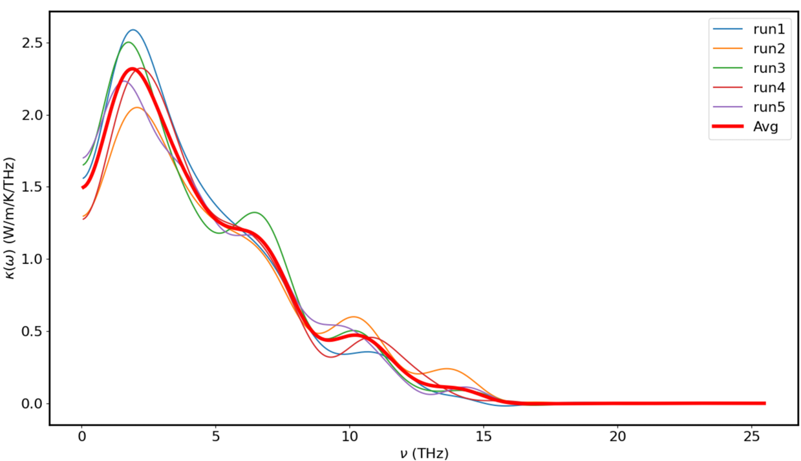
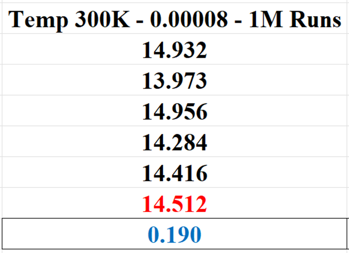
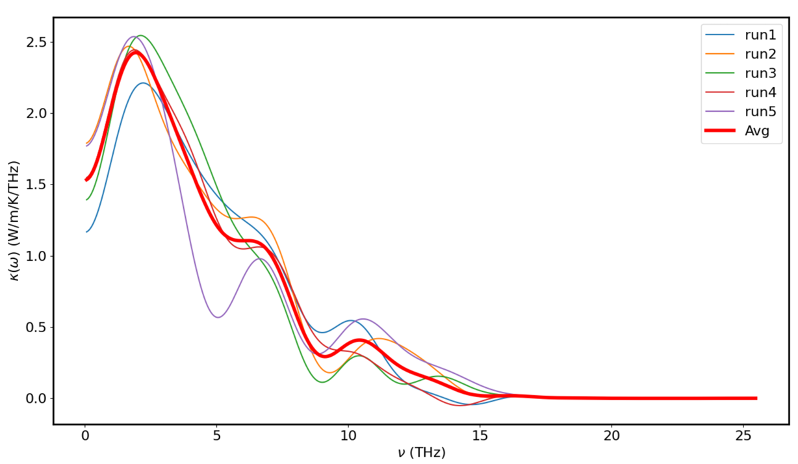
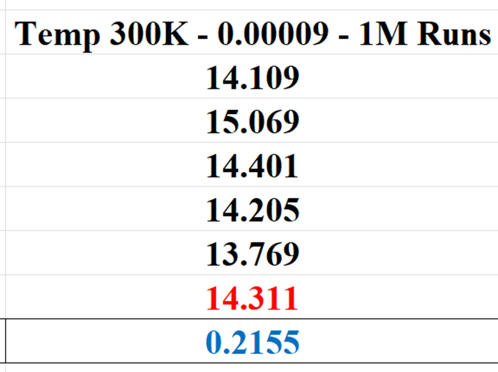
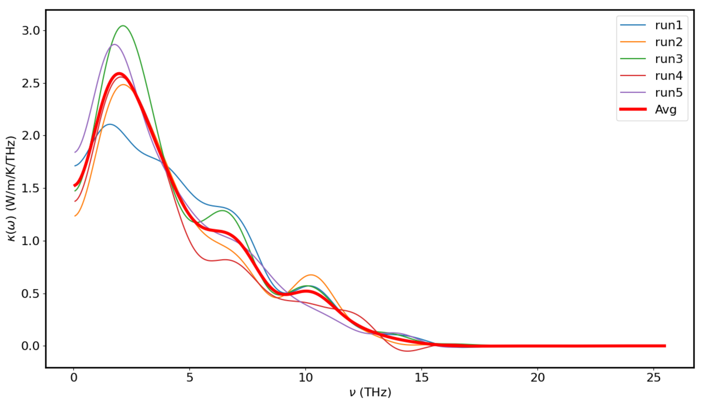
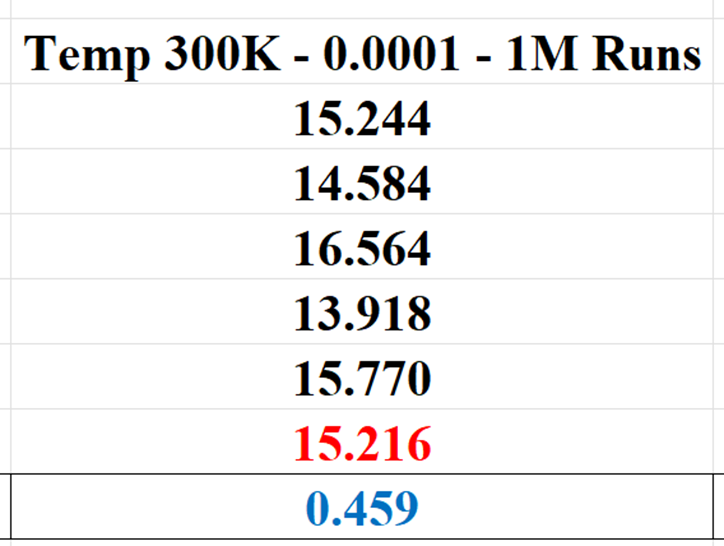
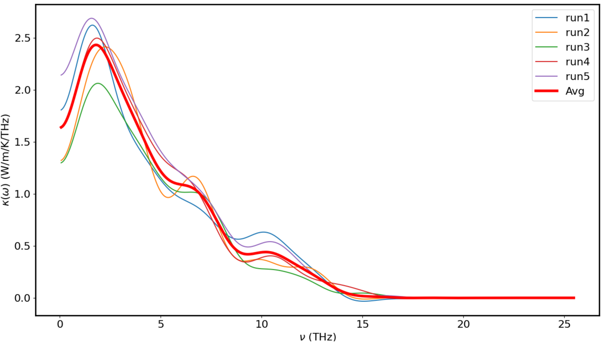
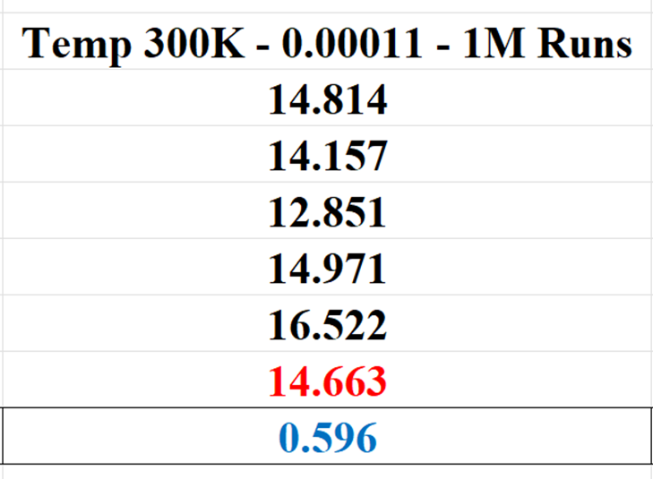
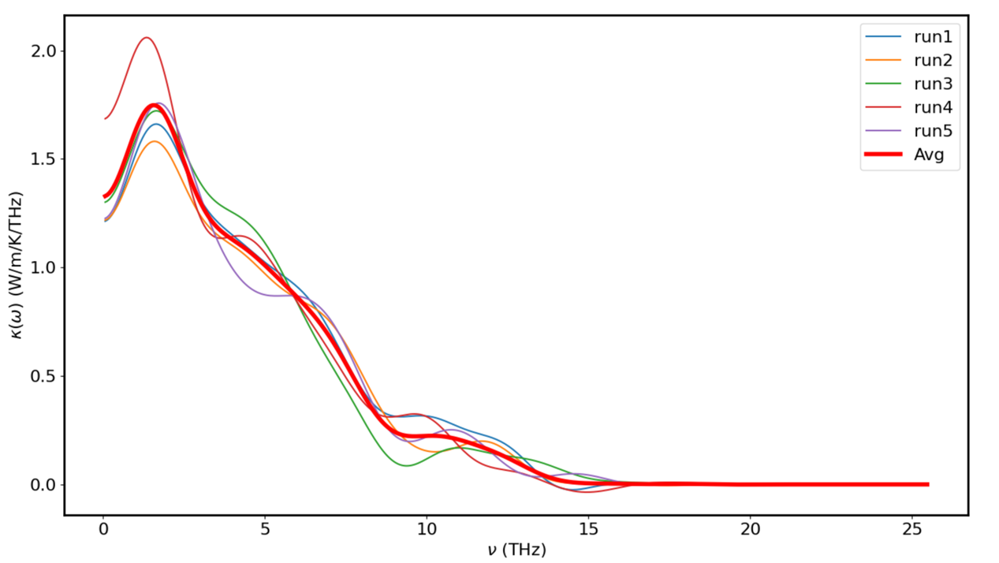
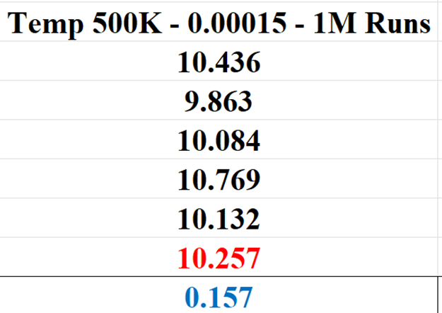

# Results and Discussion for Thermal Conductivity of Co₀.₂₅Ni₀.₇₅O (In Progress)

## Phase 1: Exploring Thermal Properties of CoNiO at Varied Temperatures (300K - 500K)

### Constructing the Co₀.₂₅Ni₀.₇₅O Model

Building on the [Thermal Conductivity work of MgNiO](../MgNiO), we use the Mg₀.₅Ni₀.₅O model to construct the Co₀.₂₅Ni₀.₇₅O model. In the MgNiO structure, there are 8000 atoms in total, consisting of 2000 Mg, 2000 Ni, and 4000 O. For the new CoNiO model, we aim to adjust the composition to 1000 Co, 3000 Ni, and 4000 O. To achieve this, we randomly select 1000 Mg atoms and transform them into Co atoms, ensuring that the overall ratio of Co:Ni:O remains 1:3:4.

However, due to structural differences between MgNiO and CoNiO, we anticipate that the optimized force parameters for MgNiO may not directly apply to CoNiO. Therefore, we will need to explore and optimize these parameters for each temperature range (300K - 500K) by conducting a new set of simulations. The details of our approach for optimizing force parameters across different temperatures can be found in the `Establishing a Best Fit Line for Optimized Forces Across Temperatures` section in the [MgNiO README file](https://github.com/huy310304/GPUMD-UVA/tree/main/MgNiO#establishing-a-best-fit-line-for-optimized-forces-across-temperatures).

### Running NPT to Get the Relaxed Volume

Since the CoNiO model is newly constructed rather than being derived from a trained model, it is necessary to first relax the system using an **NPT (constant number of particles, pressure, and temperature)** simulation. This allows the system to adjust its volume and achieve a stable, equilibrium state before further analysis.

The NPT run ensures the material reaches its natural volume under standard conditions (with pressure P set to 0) and adjusts its atomic arrangement to the conditions of the simulation. This step is critical for avoiding distortions in the structure, which could lead to inaccurate thermal conductivity results in subsequent simulations. Once the volume is relaxed, we can proceed with the **NVT (constant number of particles, volume, and temperature)** simulation for accurate thermal conductivity measurements.

We can plot the pressure from the `thermo.out` file to compare the system before and after relaxation. Below are the pressure plots without and with relaxation:

|  |  |
|:---------------------------------------------------------------------------------------------------:|:------------------------------------------------------------------------------------------------------:|
| **Pressure without relaxation** | **Pressure after relaxation** |

### Short Runs (1M steps) at 300K

We conducted short runs (1M steps) at 300K to quickly evaluate the effect of different force parameters on the thermal conductivity of Co₀.₂₅Ni₀.₇₅O. These shorter runs allowed us to explore force parameters and identify ranges that consistently stabilize thermal conductivity measurements. Once identified, these parameters can be further validated through longer simulations.

The plots below display the results for three different force parameters:

|  |  |
|:---------------------------------------------------------------------------------------------------------:|:---------------------------------------------------------------------------------------------------------:|
| **Spectral Thermal Conductivity of 5 runs at `300K with F(Å⁻¹) = 0.0001`** | **Thermal Conductivity at `300K with F(Å⁻¹) = 0.0001`** |

|  |  |
|:------------------------------------------------------------------------------------------------------------:|:------------------------------------------------------------------------------------------------------------:|
| **Spectral Thermal Conductivity of 5 runs at `300K with F(Å⁻¹) = 0.00011`** | **Thermal Conductivity at `300K with F(Å⁻¹) = 0.00011`** |

|  |  |
|:------------------------------------------------------------------------------------------------------------:|:------------------------------------------------------------------------------------------------------------:|
| **Spectral Thermal Conductivity of 5 runs at `300K with F(Å⁻¹) = 0.00012`** | **Thermal Conductivity at `300K with F(Å⁻¹) = 0.00012`** |

The force parameters tested (0.0001 Å⁻¹, 0.00011 Å⁻¹, and 0.00012 Å⁻¹) produced consistent results across all short runs, showing minimal variation in thermal conductivity measurements. The low error bars indicate high repeatability and suggest that the optimized force parameters are stabilizing the system. Given the close agreement between the different runs, these force parameters are promising candidates for further exploration.

### Long Runs (10M steps) at 300K

After identifying likely force parameters through short runs, we extended the simulation time to 10M steps to achieve more accurate and detailed results. Below are the results for force parameters ranging from 0.00008 Å⁻¹ to 0.00011 Å⁻¹:

|  |  |
|:---------------------------------------------------------------------------------------------------------:|:---------------------------------------------------------------------------------------------------------:|
| **Spectral Thermal Conductivity of 5 runs at `300K with F(Å⁻¹) = 0.00008`** | **Thermal Conductivity at `300K with F(Å⁻¹) = 0.00008`** |

|  |  |
|:---------------------------------------------------------------------------------------------------------:|:---------------------------------------------------------------------------------------------------------:|
| **Spectral Thermal Conductivity of 5 runs at `300K with F(Å⁻¹) = 0.00009`** | **Thermal Conductivity at `300K with F(Å⁻¹) = 0.00009`** |

|  |  |
|:---------------------------------------------------------------------------------------------------------:|:---------------------------------------------------------------------------------------------------------:|
| **Spectral Thermal Conductivity of 5 runs at `300K with F(Å⁻¹) = 0.0001`** | **Thermal Conductivity at `300K with F(Å⁻¹) = 0.0001`** |

|  |  |
|:------------------------------------------------------------------------------------------------------------:|:------------------------------------------------------------------------------------------------------------:|
| **Spectral Thermal Conductivity of 5 runs at `300K with F(Å⁻¹) = 0.00011`** | **Thermal Conductivity at `300K with F(Å⁻¹) = 0.00011`** |

These extended simulations confirm the findings from the short runs, with force parameters in the range of 0.00008 Å⁻¹ to 0.00011 Å⁻¹ yielding stable results. The optimal value for force parameters appears to be around 0.00008 Å⁻¹, as this produced the most consistent results with the least error.

### Long Runs (10M steps) at 500K

We applied the same process at 500K to find the optimal force parameters. Below are the results for the force parameter of 0.00015 Å⁻¹:

|  |  |
|:------------------------------------------------------------------------------------------------------------:|:------------------------------------------------------------------------------------------------------------:|
| **Spectral Thermal Conductivity of 5 runs at `500K with F(Å⁻¹) = 0.00015`** | **Thermal Conductivity at `500K with F(Å⁻¹) = 0.00015`** |

## Comprehensive Analysis of Temperature vs. Thermal Conductivity

  

The graph above demonstrates a consistent trend in thermal conductivity \( k(w) \) with smaller error bars, using optimized force parameters. As expected, thermal conductivity decreases as temperature \( T(K) \) increases, consistent with the traditional Umklapp scattering trend seen in crystalline materials. In such materials, thermal conductivity typically follows an inverse relationship with temperature, \( \propto 1/T \).

When the thermal conductivity results across different temperatures were plotted together, a clear trend emerged. Similar to the behavior observed in MgNiO, increasing temperature generally results in a decrease in thermal conductivity. However, CoNiO exhibits a significant increase in thermal conductivity, suggesting that the thermal properties of CoNiO are more sensitive to temperature variations than MgNiO.

|  |  |
|:---------------------------------------------------------------------------------------------------------:|:---------------------------------------------------------------------------------------------------------:|

**3D Plot of Average Spectral Thermal Conductivity Across Temperatures Using Optimized Force Parameters**

### Conclusion for CoNiO 

- The force parameters optimized for MgNiO were not directly applicable to CoNiO, as CoNiO was constructed by rearranging the MgNiO model rather than coming from a pre-trained model.
- CoNiO demonstrates a decrease in thermal conductivity with increasing temperatures, following the traditional Umklapp scattering trend, similar to MgNiO.
- CoNiO's thermal conductivity is significantly higher than that of MgNiO and J14 across the tested temperature range, suggesting that CoNiO experiences less scattering, making it more thermally conductive at elevated temperatures.
