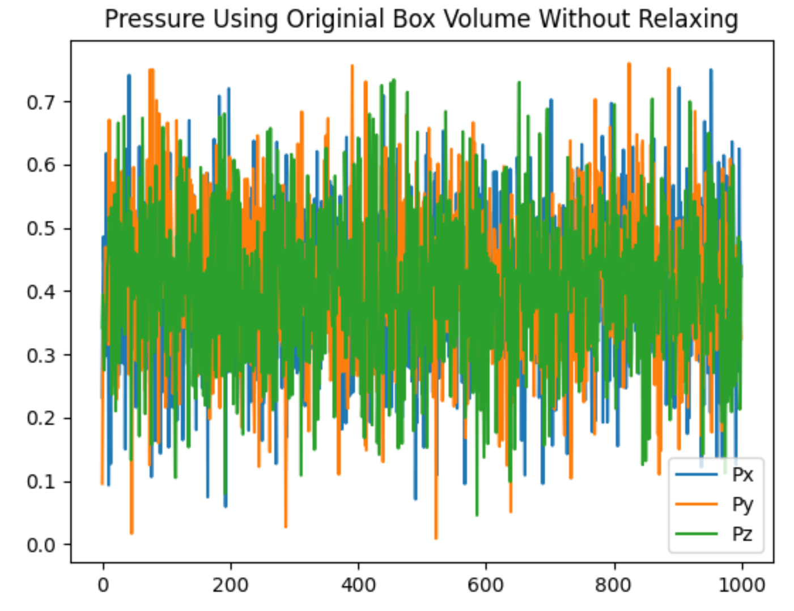
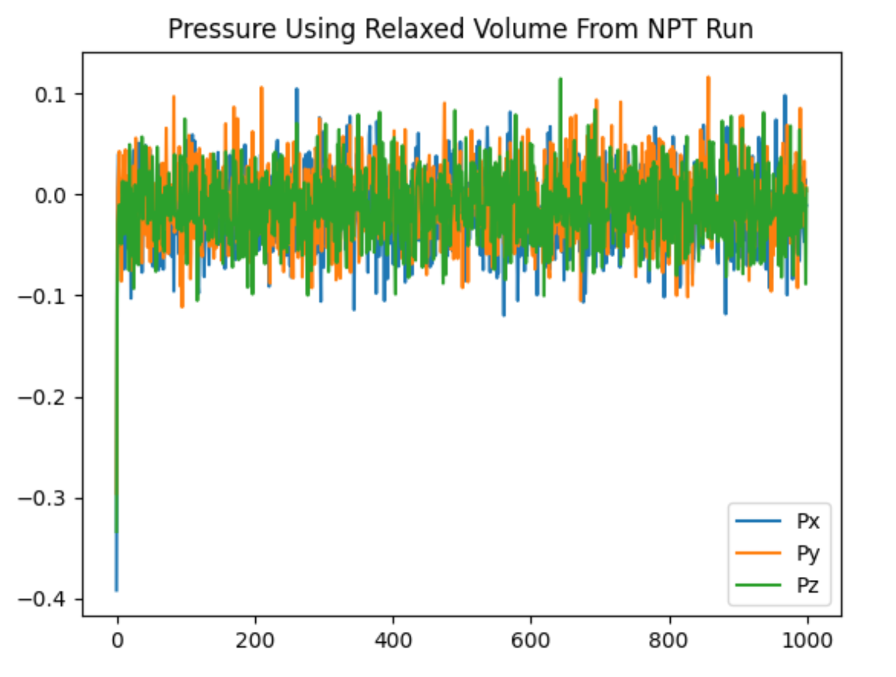
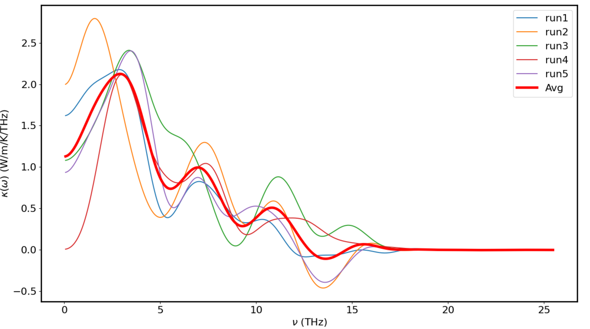
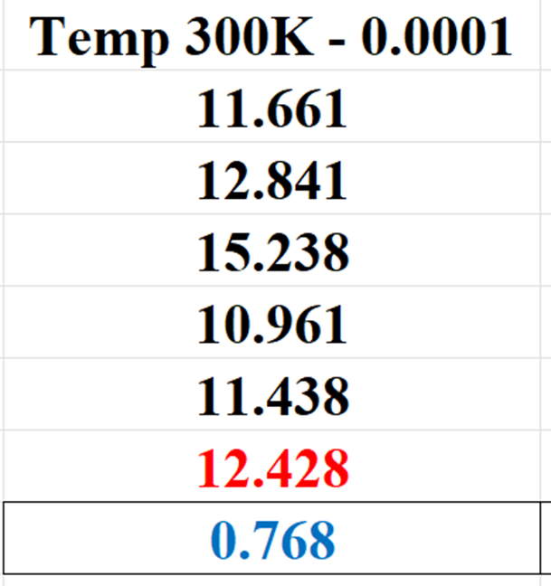
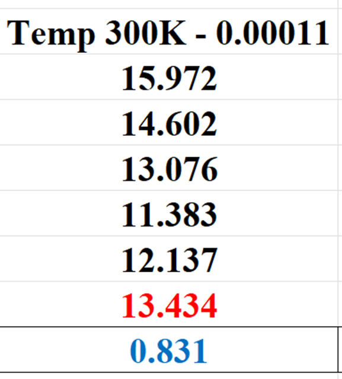
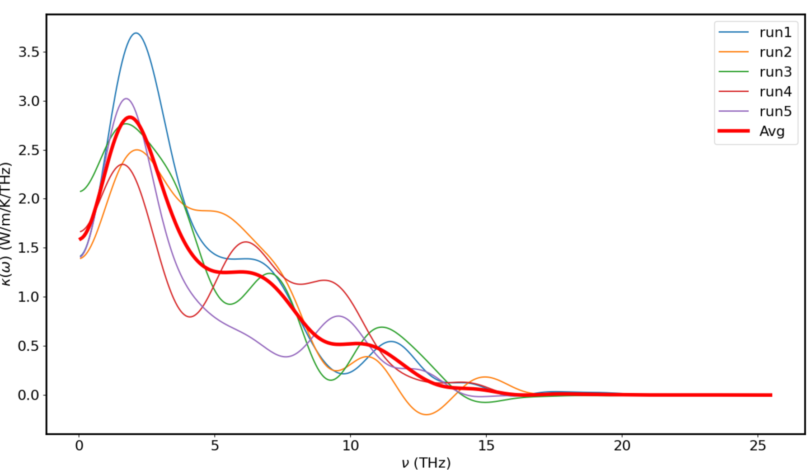
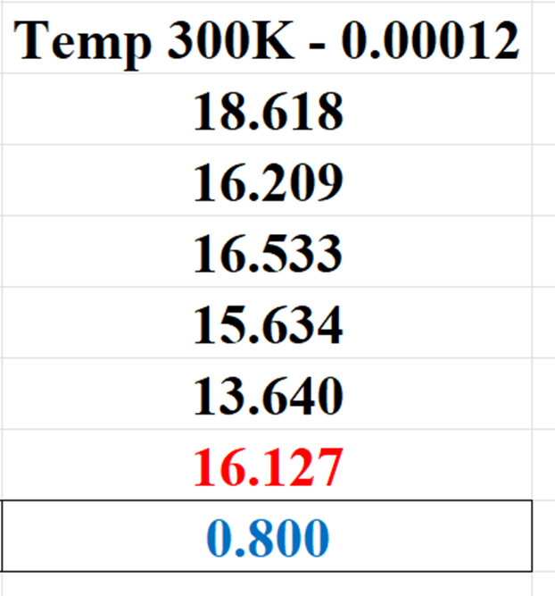

# Results and Discussion for Thermal Conductivity of Co₀.₂₅Ni₀.₇₅O (In Progress)

## Phase 1: Exploring Thermal Properties of CoNiO at Varied Temperatures (300K - 500K)

### Constructing the Co₀.₂₅Ni₀.₇₅O Model

Building on the [Thermal Conductivity work of MgNiO](../MgNiO), we use the Mg₀.₅Ni₀.₅O model to construct the Co₀.₂₅Ni₀.₇₅O model. In the MgNiO structure, there are 8000 atoms in total, consisting of 2000 Mg, 2000 Ni, and 4000 O. For the new CoNiO model, we aim to adjust the composition to 1000 Co, 3000 Ni, and 4000 O. To achieve this, we randomly select 1000 Mg atoms and transform them into Co atoms, ensuring that the overall ratio of Co:Ni:O remains 1:3:4.

However, due to structural differences between MgNiO and CoNiO, we anticipate that the optimized force parameters for MgNiO may not directly apply to CoNiO. Therefore, we will need to explore and optimize these parameters for each temperature range (300K - 500K) by conducting a new set of simulations. The details of our approach for optimizing force parameters across different temperatures can be found in the `Establishing a Best Fit Line for Optimized Forces Across Temperatures` section in the [MgNiO README file](https://github.com/huy310304/GPUMD-UVA/tree/main/MgNiO#establishing-a-best-fit-line-for-optimized-forces-across-temperatures).

### Running NPT to Get the Relaxed Volume

Since the CoNiO model is newly constructed rather than being derived from a trained model, it is necessary to first relax the system using an **NPT (constant number of particles, pressure, and temperature)** simulation. This allows the system to adjust its volume and achieve a stable, equilibrium state before further analysis.

The NPT run ensures the material reaches its natural volume under standard conditions (with pressure P set to 0) and adjusts its atomic arrangement to the conditions of the simulation. This step is critical for avoiding distortions in the structure, which could lead to inaccurate thermal conductivity results in subsequent simulations. Once the volume is relaxed, we can proceed with the **NVT (constant number of particles, volume, and temperature)** simulation for accurate thermal conductivity measurements.

We can plot the pressure from the `thermo.out` file to compare the system before and after relaxation. Below are the pressure plots without and with relaxation:

|  |  |
|:---------------------------------------------------------------------------------------------------:|:------------------------------------------------------------------------------------------------------:|
| **Pressure without relaxation** | **Pressure after relaxation** |

### Short Runs (1M steps) at 300K
|  |  |
|:---------------------------------------------------------------------------------------------------------:|:---------------------------------------------------------------------------------------------------------:|
| **Spectral Thermal Conductivity of 5 runs at `300K with F(Å⁻¹) = 0.0001`** | **Thermal Conductivity at `300K with F(Å⁻¹) = 0.0001`** |

|  |  |
|:------------------------------------------------------------------------------------------------------------:|:------------------------------------------------------------------------------------------------------------:|
| **Spectral Thermal Conductivity of 5 runs at `300K with F(Å⁻¹) = 0.00011`** | **Thermal Conductivity at `300K with F(Å⁻¹) = 0.00011`** |

|  |  |
|:------------------------------------------------------------------------------------------------------------:|:------------------------------------------------------------------------------------------------------------:|
| **Spectral Thermal Conductivity of 5 runs at `300K with F(Å⁻¹) = 0.00012`** | **Thermal Conductivity at `300K with F(Å⁻¹) = 0.00012`** |

These short runs (1M steps) are intended to minimize simulation time while exploring force parameters for consistent behavior. Once we identify consistent force parameters, we can extend the simulations to 10M steps for more accurate results.

These force parameters are likely correct, as the results exhibit a high level of consistency across multiple runs, with minimal variation between individual runs. This consistency, indicated by the low error bars, suggests that the optimized force parameters effectively stabilize the thermal conductivity measurements for Co₀.₂₅Ni₀.₇₅O at 300K.
