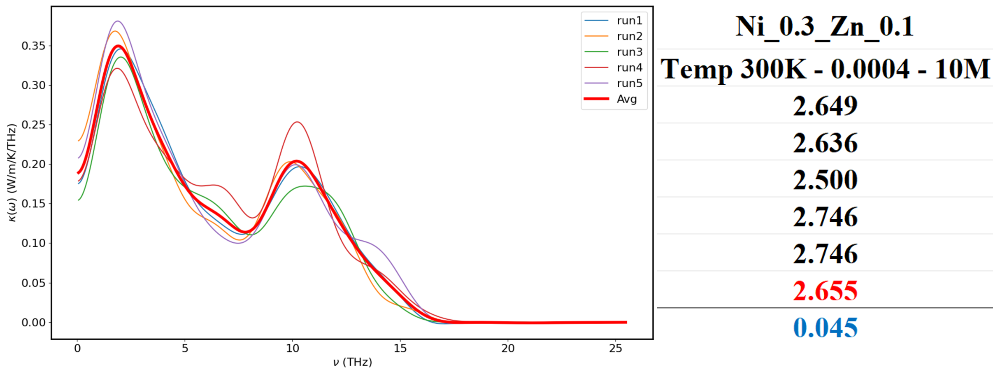
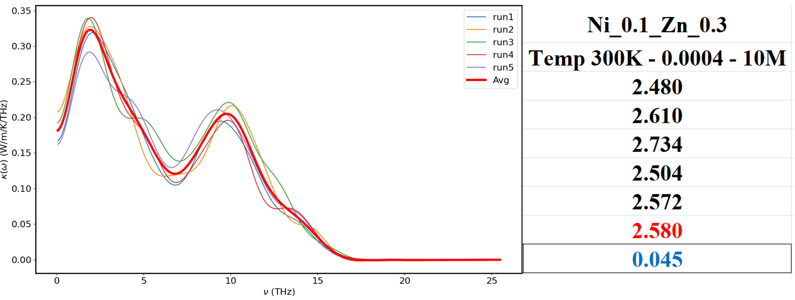
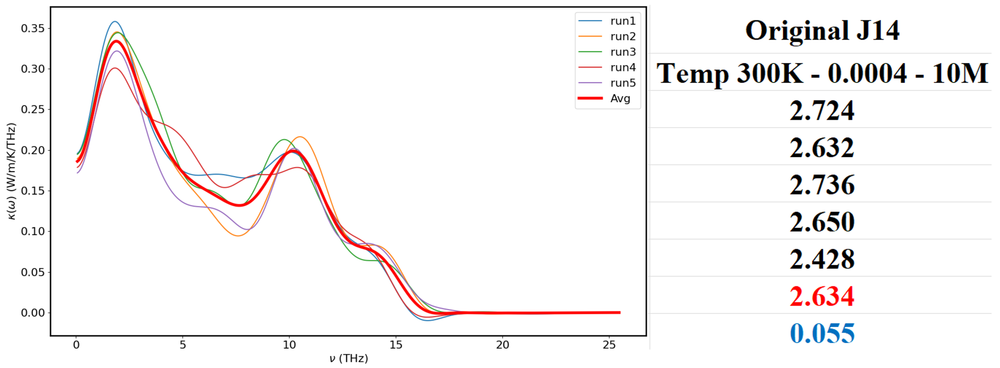

# Results and Discussion for Thermal Conductivity of (Mg₀.₂Co₀.₂Ni₀.₂Cu₀.₂Zn₀.₂)O (J14) (In Progress)

## Phase 1: Exploring Thermal Properties of the J14 at Varied Temperatures (100K - 900K)

Building on the [Thermal Conductivity work of Mg₀.₅Ni₀.₅O](../MgNiO), we applied the optimized force parameters from Mg₀.₅Ni₀.₅O to a new alloy, referred to as J14. We obtained results for each temperature, using the optimized F-values from Mg₀.₅Ni₀.₅O as an educated starting point. However, due to the structural differences of the J14 alloy, adjustments may be necessary. Details of the approach for optimizing the forces across different temperatures can be found in the `Establishing a Best Fit Line for Optimized Forces Across Temperatures` section in the [Mg₀.₅Ni₀.₅O README file](https://github.com/huy310304/GPUMD-UVA/tree/main/MgNiO#establishing-a-best-fit-line-for-optimized-forces-across-temperatures). After multiple runs and extensive data analysis, we can find the appropriate force parameters for the specific temperatures.

### Results for 300K Using F-values of 0.00018

|  |  |
|:---------------------------------------------------------------------------------------------------------:|:---------------------------------------------------------------------------------------------------------:|
| **Spectral Thermal Conductivity of 5 runs at `300K with F(Å⁻¹) = 0.00018`** | **Thermal Conductivity at `300K with F(Å⁻¹) = 0.00018`** |

From these results, we observe that the thermal conductivities are reasonable within a small error margin, and all runs were consistent. This suggests that the optimized force parameter for Mg₀.₅Ni₀.₅O may be close to the optimized force for the J14.

### Additional Results at Different Temperatures (500K, 700K, and 900K)

|  |  |
|:---------------------------------------------------------------------------------------------------------:|:---------------------------------------------------------------------------------------------------------:|
| **Spectral Thermal Conductivity of 5 runs at `500K with F(Å⁻¹) = 0.00024`** | **Thermal Conductivity at `500K with F(Å⁻¹) = 0.00024`** |

|  |  |
|:---------------------------------------------------------------------------------------------------------:|:---------------------------------------------------------------------------------------------------------:|
| **Spectral Thermal Conductivity of 5 runs at `700K with F(Å⁻¹) = 0.00032`** | **Thermal Conductivity at `700K with F(Å⁻¹) = 0.00032`** |

|  |  |
|:---------------------------------------------------------------------------------------------------------:|:---------------------------------------------------------------------------------------------------------:|
| **Spectral Thermal Conductivity of 5 runs at `900K with F(Å⁻¹) = 0.0004`** | **Thermal Conductivity at `900K with F(Å⁻¹) = 0.0004`** |

All these results exhibit a high level of consistency across multiple runs, with minimal variation between individual runs as indicated by the low error bars. This consistency suggests that the optimized force parameters effectively stabilize the thermal conductivity measurements for the J14 across the tested temperature range (300K - 900K).

### Comprehensive Analysis of Temperature vs. Thermal Conductivity

The results of the thermal conductivity across different temperatures were plotted together, and a clear trend emerges. Unlike the behavior observed in Mg₀.₅Ni₀.₅O, where increasing temperature typically results in lower thermal conductivity, the J14 shows relatively stable thermal conductivity across different temperatures. This suggests that the J14’s thermal properties are less sensitive to temperature changes compared to Mg₀.₅Ni₀.₅O.

|  |  |
|:---------------------------------------------------------------------------------------------------------:|:---------------------------------------------------------------------------------------------------------:|

**3D Plot of Average Spectral Thermal Conductivity Across Temperatures Using Optimized Force Parameters**

#### Analysis of Trends

- **Stable Thermal Conductivity**: The thermal conductivity across temperatures shows less variation compared to Mg₀.₅Ni₀.₅O. This could be attributed to the high-entropy nature of the alloy, where the atomic disorder contributes to a more stable phonon scattering mechanism across temperatures. (See `Comprehensive Analysis of Temperature vs. Thermal Conductivity` section in the [Mg₀.₅Ni₀.₅O README file](https://github.com/huy310304/GPUMD-UVA/tree/main/MgNiO#comprehensive-analysis-of-temperature-vs-thermal-conductivity)).
  
- **Comparison with Mg₀.₅Ni₀.₅O**: The results suggest that while Mg₀.₅Ni₀.₅O shows a clear decrease in thermal conductivity with temperature, the J14 alloy maintains a more consistent thermal conductivity, potentially making it more suitable for applications requiring stable thermal performance across a wide temperature range.

- **Lower Thermal Conductivity**: The thermal conductivity of the J14 is generally lower than that of Mg₀.₅Ni₀.₅O, as shown in the graph below:

**Temperature vs. Thermal Conductivity for the J14, Mg₀.₅Ni₀.₅O, Co₀.₂₅Ni₀.₇₅O at Varied Temperatures**

### Conclusion for Phase 1

- The force parameters optimized for Mg₀.₅Ni₀.₅O were also applicable to the J14, resulting in consistent thermal conductivity measurements across all temperatures and runs.
- The J14 demonstrates more consistent thermal conductivity across different temperatures compared to the decreasing trend observed in Mg₀.₅Ni₀.₅O and Co₀.₂₅Ni₀.₇₅O.
- The thermal conductivity of the J14 is lower than that of Mg₀.₅Ni₀.₅O and Co₀.₂₅Ni₀.₇₅O across the tested temperature range.
- These findings suggest that the J14 might be more suitable for applications where stable thermal performance is required across a wide temperature range.
- Materials like Mg₀.₅Ni₀.₅O and Co₀.₂₅Ni₀.₇₅O exhibit a more traditional Umklapp scattering trend. This trend is typical of crystalline materials, where thermal conductivity decreases with increasing temperature (∝ 1/T).
- These crystalline oxides also show higher thermal conductivities than J14, reflecting the less disordered crystal structure that allows for more efficient phonon transport (less scattering).

## Phase 2: Tuning the Thermal Conductivity of the J14 at Temp 300K and F = 0.0004

In the next phase, we will explore how to tune the thermal conductivity of the J14 by adjusting the concentrations of its components. Specifically, we will investigate the effects of lowering the concentration of Ni to 0.1 and increasing Zn to 0.3, as well as the reverse scenario of increasing Ni to 0.3 and reducing Zn to 0.1.

Since Zn has the largest atomic radius among the five elements in J14, increasing its concentration to 0.3 is expected to introduce more lattice distortion and phonon scattering due to size mismatch. This, in turn, should reduce the thermal conductivity (TC). On the other hand, increasing the Ni concentration to 0.3 and lowering Zn to 0.1 will likely result in less lattice distortion and scattering, leading to a potential increase in thermal conductivity.

These experiments will be conducted at 300K as an illustrative example to assess how these concentration changes impact the thermal properties of J14.

### Model Creation
We use original J14 model to construct the (Mg 0.2 Co 0.2 Ni 0.3 Cu 0.2 Zn 0.1)O model. In the J14 structure, there are 8000 atoms in total, consisting of 800 Mg, 800 Co, 800 Ni, 800 Cu, 800 Zn, and 4000 O. For the two new models, we aim to adjust the composition to 800 Mg, 800 Co, 1200 Ni, 800 Cu, 400 Zn, and 4000 O for the Mg₀.₂Co₀.₂Ni₀.₃Cu₀.₂Zn₀.₁O and 800 Mg, 800 Co, 400 Ni, 800 Cu, 1200 Zn, and 4000 O for the Mg₀.₂Co₀.₂Ni₀.₁Cu₀.₂Zn₀.₃O To achieve this, we randomly select 400 Zn atoms and transform them into Ni atoms and vice versa. See [J14 Model Tuning Creation Folder](./Tuning/)

Following the same process of finding the optimized force for Temp = 300K, F(Å⁻¹) = 0.0004 was decided as the final force to run the 3 models (J14, Mg₀.₂Co₀.₂Ni₀.₃Cu₀.₂Zn₀.₁O (1200 Ni and 400 Zn), and Mg₀.₂Co₀.₂Ni₀.₁Cu₀.₂Zn₀.₃O (400 Ni and 1200 Zn)) to ensure consistency and further analyze the distortion/changing in thermal conductivity.

### Thermal Conductivity Results

#### (Mg₀.₂Co₀.₂Ni₀.₃Cu₀.₂Zn₀.₁)O (1200 Ni and 400 Zn)
The thermal conductivity of (Mg₀.₂Co₀.₂Ni₀.₃Cu₀.₂Zn₀.₁)O (1200 Ni and 400 Zn) is around **2.655 ± 0.045 W/mK**.

#### (Mg₀.₂Co₀.₂Ni₀.₁Cu₀.₂Zn₀.₃)O (400 Ni and 1200 Zn)
The thermal conductivity of (Mg₀.₂Co₀.₂Ni₀.₁Cu₀.₂Zn₀.₃)O (400 Ni and 1200 Zn) is around **2.580 ± 0.045 W/mK**.

#### (Mg₀.₂Co₀.₂Ni₀.₂Cu₀.₂Zn₀.₂)O (J14 Model) (800 Ni and 800 Zn)
The thermal conductivity of the original J14 model (800 Ni and 800 Zn) is approximately **2.634 ± 0.055 W/mK**.

### Graphical Analysis

### Graphical Analysis

The following graphs visually represent the thermal conductivity results and the percentage differences between the models:

[TC comparison](./images/TC_comparison.png)

[Percentage Diff](./images/Percentage_Difference.png)]

- **Thermal Conductivity of Various Models (Ordered: Ni₀.₁ - J14 - Ni₀.₃)**:
    - As seen in the graph, increasing Ni concentration to 0.3 and reducing Zn to 0.1 increases the thermal conductivity to 2.655 W/mK. Conversely, lowering Ni to 0.1 and increasing Zn to 0.3 reduces the thermal conductivity to 2.580 W/mK. 
    - The J14 model, with equal concentrations of Ni and Zn, has a thermal conductivity that sits between these values at 2.634 W/mK.

- **Percentage Difference in Thermal Conductivity Relative to J14 Model (Ordered: Ni₀.₁ - J14 - Ni₀.₃)**:
    - The second graph highlights how the thermal conductivity changes relative to the J14 model. Increasing Zn leads to a ~2.05% decrease in thermal conductivity, while increasing Ni leads to a ~0.8% increase. This indicates that Zn’s larger atomic size, contributing to more lattice distortion, has a more significant impact on reducing thermal conductivity compared to the influence of Ni.

### Conclusions

Our study reveals that adjusting the concentrations of Ni and Zn in the J14 model significantly impacts its thermal conductivity:

1. **Increasing Ni concentration (Ni₀.₃, Zn₀.₁)** results in higher thermal conductivity (2.655 W/mK). This is likely due to the reduced lattice distortion and phonon scattering when fewer Zn atoms are present, as Zn’s larger atomic radius introduces more disorder in the lattice.

2. **Increasing Zn concentration (Ni₀.₁, Zn₀.₃)** leads to a decrease in thermal conductivity (2.580 W/mK). The greater presence of Zn atoms causes more lattice distortion, phonon scattering, and mismatch, reducing the overall thermal conductivity.

3. The **J14 model (Ni₀.₂, Zn₀.₂)** demonstrates an intermediate thermal conductivity (2.634 W/mK), consistent with a balanced atomic composition.

These findings suggest that manipulating the concentrations of Ni and Zn in materials like J14 offers a pathway to tune thermal conductivity, which could be valuable in applications where controlling heat transfer is critical. Future work may involve investigating other temperatures or force constants to better understand the underlying mechanisms.

